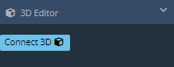
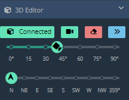
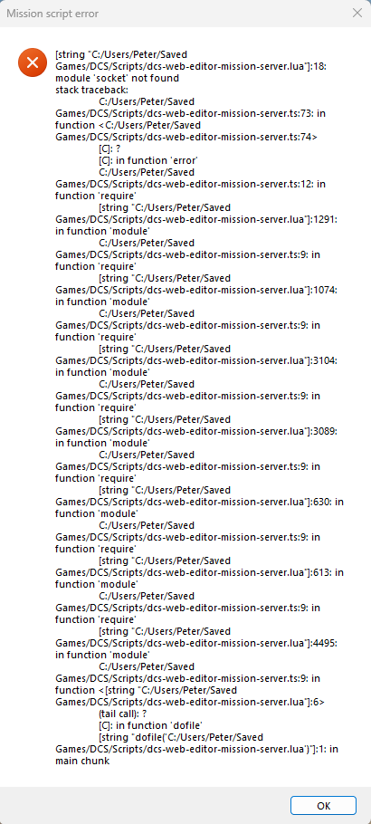
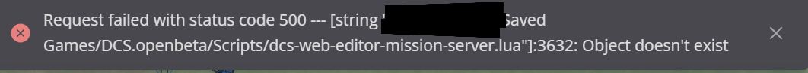

# 3D Editor

## Setup

You need to download and install three files for the 3D Editor to connect.

In the future, there will be an official installer released that will do this for you.

&nbsp;

For now, there are two ways to move the files to the correct location:

### Powershell Method

<a href="../scripts/3D-Script-Installer.ps1" download><b>3D-Script-Installer.ps1</b></a>

  - Move this file to your MAIN INSTALLATION folder, ex: `Drive:\Program Files\Eagle Dynamics\DCS World OpenBeta`, right-click the file and select 'Run with Powershell'.
  - This script assumes you have never moved your Saved Games folder.
  - Requires Powershell (the vast majority of Windows machines have this pre-installed).

### Manual Method

<a href="../scripts/dcs-web-editor-gui-server.lua" download><b>dcs-web-editor-gui-server.lua</b></a>

  - Move this file to `C:\Users\<your username here>\Saved Games\DCS.openbeta\Scripts\Hooks`

<a href="../scripts/dcs-web-editor-mission-server.lua" download><b>dcs-web-editor-mission-server.lua</b></a>

  - Move this file to `C:\Users\<your username here>\Saved Games\DCS.openbeta\Scripts`

<a href="../scripts/MissionScripting.lua" download><b>MissionScripting.lua</b></a>

  - Note that this file already exists in the DCS structure.
  - If you're already familiar with what this file does, you may wish to download this file, compare, and make the required additions instead of overwriting.
  - Otherwise, move this file to `Drive:\Program Files\Eagle Dynamics\DCS World OpenBeta\Scripts` and **OVERWRITE**.
  - Note that this file goes into your installation folder, **NOT YOUR SAVED GAMES FOLDER**.
  - **WARNING** - Don't open suspicious missions in DCS while require and package are not set to nil. **Use at your own risk**.

## Start DCS

Run DCS World.

Go to the DCS Mission Editor and create a new mission in the theatre you wish to use.

**DO NOT MAKE ANY CHANGES**

Save the blank mission, naming it anything you wish.

Now either press Ctrl + P to run the mission, or exit and run the mission through single player.

## Connecting

Go to the Web Editor, load the .miz you wish to work on and press the `Connect 3D` button. See [troubleshooting](#troubleshooting)

You can also go to [http://127.0.0.1:31480/health](http://127.0.0.1:31480/health) to check if the server is running

## Current Limitations

 - By default, only missions up to 1000 units are synced in the 3D view. Othwise you need to sync them manually for performance reasons. How? Select objects via Shift click + drag and they will appear in DCS. This is to prevent a performance hog when you open a mission with thousands of statics.
 - Aircraft always spawn on ground in 3D view.
 - Some objects like containers like to pile up in air while dragged. Press the blue >> sync button to bring them back to the ground.

## Operation

### UI

 - Connected -> Press again to disconnect.
 - Camera -> Press to stop camera mouse follow. You can also press "F" which is more convenient. Its useful to keep the camera in place for dropping units on buildings or dropping templates, or adjusting the camera angles.
 - Erase -> Press the eraser to delete all statics inside DCS.
 - Sync -> Press the blue >> button to sync all statics between your mission and DCS. This may fix some issues when assets float in air. It may take a while when you have thousands of objects. So use with care!

### 3D Editor Shortcuts

- F -> Toggle camera in place/follow cursor.
- Ctrl -> Ground view while holding.
- Alt -> Bird's Eye view while holding.
- 1 -> Point camera North.
- 2 -> Point camera East.
- 3 -> Point camera South.
- 4 -> Point camera West.

## Troubleshooting

### Bad Connection
If you are using Brave browser, having Shields enabled will break this process. Disable it.
We recommend Chromium / Chrome and disable browser extensions if you have issues / lag.

### DCS Startup error
If you see this error when starting DCS, it means your MissionScripting.lua is incorrect. You may have placed it in the wrong folder or forgot to restart DCS after overwriting the file. Make sure you follow [the installation.](#manual-method)

:warning: DCS Updates will overwrite the MissionScripting.lua, so you need to reinstall the file after every DCS update. 

### 3D Editor connection error

If you see this error, it means DCS is not running (on the same machine). Or the dcs-web-editor-gui-server.lua file is not installed correctly.
Make sure you follow [the installation.](#manual-method)

> :cross_mark: Cannot connect to DCS. It requires the DcsWebEditor scripts to be installed. And DCS needs to be running an empty mission

### Mission not running
If you see this error, it means  you haven't started the empty singleplayer missions we provided. Also make sure the mission you start in DCS matches the theater in DCS Web Editor.
> :cross_mark: Mission not running. You need to start an empty SinglePlayer mission in DCS

### Cant spawn objects
Should you see this error, it usually means you tried to spawn an object/mod you haven't installed in DCS. Mostly missing mods etc. Sometimes you may also need to restart DCS if you see many network errors. Or disconnect and connect again in the DWE menu.

