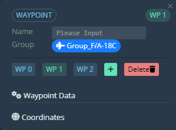
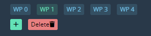

# Waypoints

## Waypoint 0 Panel

Waypoint 0 can only be accessed from the Unit Panel. Open the Waypoint Settings to display the waypoint options.

Existing waypoints are displayed beneath the waypoint options. Clicking on these will open the corresponding waypoint's Waypoint Panel. Aside from WP0, the currently selected waypoint is highlighted in green.

## Waypoint Panel

Here you can input your waypoint name, select other waypoints, add or delete the waypoint.

### Data

Just as in the Unit Panel waypoint data settings, set your waypoint parameters here.

### Coordinates

Same as [Unit Panel coordinates](./units.md/#coordinates).

## Waypoint Manipulation

### Add Waypoints

To add a waypoint, press the green `+` button. This will create a waypoint between your currently selected waypoint and the next waypoint in the sequence. The newly created waypoint's panel will automatically open.

### Select/Deselect Waypoints

Click on any waypoint to open it's Waypoint Panel.

Select waypoints using `Shift + LClick + Drag`.

Deselect waypoints with `Esc` or `RClick` on the map.

### Move Waypoints

`LClick + Drag` waypoints to move them. Waypoints do not need to be selected to move them with this method.

Select multiple waypoints with the Select Box and move them using the same method.

### Delete Waypoints

Press `Del` to delete any selected waypoints, or press the `Delete` button in the Waypoint Panel.

