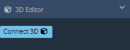
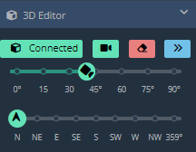

# 3D Editor

## Setup

You need to download and install three files for the 3D Editor to connect.

In the future, there will be an installer released that will do this for you.

&nbsp;

**[dcs-web-editor-gui-server.lua](./scripts/dcs-web-editor-gui-server.lua)**:

  - Move this file to `C:\Users\<your username here>\Saved Games\DCS.openbeta\Scripts\Hooks`

**[dcs-web-editor-mission-server.lua](./scripts/dcs-web-editor-mission-server.lua)**:

  - Move this file to `C:\Users\<your username here>\Saved Games\DCS.openbeta\Scripts`

**[MissionScripting.lua](./scripts/MissionScripting.lua)**

  - Note that this file already exists in the DCS structure.
  - If you're already familiar with what this file does, you may wish to download this file, compare, and make the required additions instead of overwriting.
  - Otherwise, move this file to `Drive:\Program Files\Eagle Dynamics\DCS World OpenBeta\Scripts` and **OVERWRITE**.
  - Note that this file goes into your installation folder, **NOT YOUR SAVED GAMES FOLDER**.
  - **WARNING** - Don't open suspicious missions in DCS while require and package are not set to nil. **Use at your own risk**.

## Start DCS

Run DCS World.

Go to the DCS Mission Editor and create a new mission in the theatre you wish to use.

**DO NOT MAKE ANY CHANGES**

Save the blank mission, naming it anything you wish.

Now either press Ctrl + P to run the mission, or exit and run the mission through single player.

## Connecting

If you are using Brave browser, having Shields enabled will break this process. Disable it.

Go to the Web Editor, load the .miz you wish to work on and press the `Connect 3D` button.

## Limitations

 - By default, only missions up to 1000 units are synced in the 3D view. Othwise you need to sync them manually for performance reasons. How? Select objects via Shift click + drag and they will appear in DCS. This is to prevent a performance hog when you open a mission with thousands of statics.
 - Aircraft always spawn on ground in 3D view.
 - Objects placed on carriers will be submerged in 3D view.
 - Some objects like containers like to pile up in air while dragged. Press the blue >> sync button to bring them back to the ground.

## Operation

### UI

 - Connected -> Press again to disconnect.
 - Camera -> Press to stop camera mouse follow. You can also press "F" which is more convenient. Its useful to keep the camera in place for dropping units on buildings or dropping templates, or adjusting the camera angles.
 - Erase -> Press the eraser to delete all statics inside DCS.
 - Sync -> Press the blue >> button to sync all statics between your mission and DCS. This may fix some issues when assets float in air. It may take a while when you have thousands of objects. So use with care!

### 3D Editor Shortcuts

- F -> Toggle camera in place/follow cursor.
- Ctrl -> Ground view while holding.
- Alt -> Bird's Eye view while holding.
- 1 -> Point camera North.
- 2 -> Point camera East.
- 3 -> Point camera South.
- 4 -> Point camera West.

