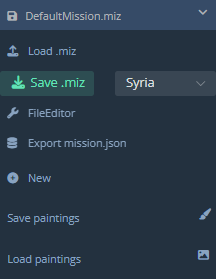

# Mission Panel

  

The mission panel allows you to load and save missions, create a new instance of the DCS Web Editor, as well as use some cool tools for manipulating the script files of your missions.

## Load

Press `Load .miz`, alternatively use the `Ctrl + L` keyboard shortcut. This will open a file explorer window to navigate to your desired .miz file.

## Save

Press `Save .miz` to bring up the file explorer. Alternatively use the `Ctrl + S` ( save mission ) or `Ctrl + Shift + S` ( save mission without prompt ) keyboard shortcuts. 

## Theatre

The theatre dropdown enables you to select the current theatre you wish to edit.

**NOTE**: If you scroll to a different region on the map and begin placing units, the editor will allow you to do so even if you haven't selected the correct theatre in the dropdown. In this case, the necessary changes to the scripts in the .miz will NOT be made. 

ALWAYS ensure the theatre you plan to work in is selected to ensure your units aren't deleted when transferring to DCS.

## File Editor

If you know your way around the scripting end of your mission files, this can be a handy tool to find or change scripts within the mission quickly. Select the folder on the far left panel and the script itself on the panel immediately adjacent.

## Export mission.json

As the name suggests, this button will export the mission script file contained within the .miz in a `.json` format.

## New

Pressing the '+ New' button will open a new browser tab with a clean mission. Remember to change to the desired theatre with the dropdown menu before placing units.

## Save Paintings

All paintings and text added via the UI Tools will be exported in a `.json` format.

These paintings are compatible with the [DCS Web Viewer](https://dcs-web-editor.github.io/dcs-web-viewer-deploy/) and vice versa.

## Load Paintings

Load a .json file of previously saved paintings.

