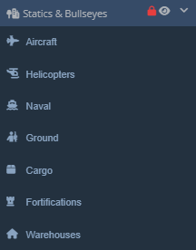

# Statics & Bullseyes

The Statics Window and Panel looks and works the exact same way as the [Units Window](../units/units.md/#units-window) and [Units Panel](../units/units.md/#unit-panel).

## Static Manipulation

### Place Statics

From any of the Statics tabs in the Statics window, `LClick + Drag` a static from the window onto the map to place.

Copy and Paste any static or group of static by selecting them via `Shift + LClick + Drag`, and then `Ctrl + C` to copy, `Ctrl + V` to paste. You can also paste statics by `RClick` on the map and selecting `Paste Here` from the coordinate window.

### Select/Deselect Statics

Click on any static to open it's Statics Panel.

Select statics using `Shift + LClick + Drag`.

Deselect statics with `Esc`.

### Move Statics

`LClick + Drag` statics to move them. Statics do not need to be selected to move them with this method.

Select multiple statics with the Select Box and move them using the same method.

### Transform Statics

`Shift + R` will rotate selected statics in random directions.

`Shift + Alt + R` rotates selected statics to 0 degrees.

`Shift + L` aligns selected statics along a single axis, using Paste Offset parameters for spacing and direction.

`Shift + P` randomizes the position of selected statics using Paste Offset parameters.

`Shift + G` aligns selected statics to a grids, using Paste Offset parameters to build the grid spacing.

`Shift + T` to transform, scale, and rotate selected statics. Select statics and then press `Shift + T` to show the Transformation Box. `LClick + Drag` within the box will drag the statics. `LClick + Drag` edge tabs will scale the statics along that axis. `LClick + Drag` just outside a corner tab will allow for rotation of selected statics. Press `Esc` or `RClick` anywhere to deselect the statics and Transformation Box.

### Delete Statics

Press `Del` to delete any selected statics.