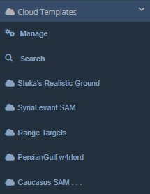

## Templates

Templates:  
  
  
All you're likely to see when you start off is the above; the category botton and a Manage button. You can add Template categories, and they will also get added to the Interface category dropdown menu, like so:  
  
  
Hit manage and let's take a look at the main window:  
  
  
Like most other windows in the DCSWE, there's a search function and tabs. Notice the 'New Tab' button as well as the 'Import' button. The 'New Tab' button creates a new Template Category which you can add templates to. 'Import' directly imports a Template Category to your DCSWE.

### Create Template

To make a template, you first need to create a template category. Press the '+' button either up in the tabs or the '+ New Tab' button. You will now see a template category in the list on the 'Manage' tab.

Press 'Rename' to name the category. You will now see it in your tabs. Click on your newly created category:

You will see the above. From here, you can Shift + LClick drag to select entities. Then enter a name and description and click 'Add Template' to create a template. You can have multiple templates in the same category.

### Place Template

To place a template that you've created or imported, LClick and drag one of the template icons in the window onto the map.

### Update/Delete Template

To update a template, select it in the window. Select the new units and press 'Update'.

To delete a template, select it in the tab and press 'Delete.'

### Import Templates

First you'll need to download templates that you wish to import. Head to the DCS Web Editor Dicord and download your desired template from the 'template-sharing' channel. Templates are provided as a .json file. Press Import in the 'Manage' tab on the Web Editor Template window, then select the .json file you downloaded. Your imported templates should now be in a new tab.

### Delete Category

To delete a category, head back to the 'Manage' tab. Press 'Delete' next to category you wish to delete.

