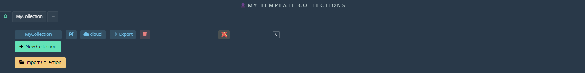
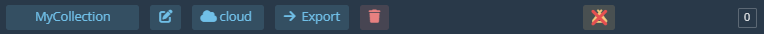
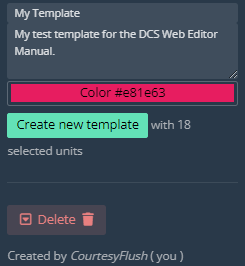
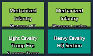
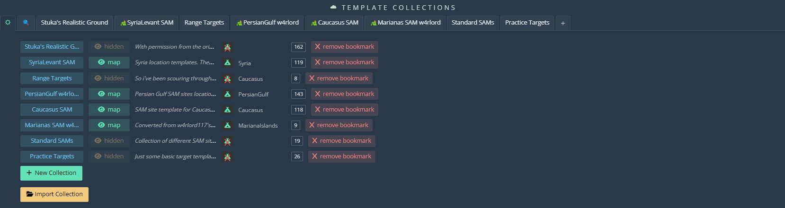

# Templates

## Local Templates
 
  
  
### Local Template Window

  
  
`+ New Collection` will start the process of [creating a new local template](#create-template).

`Import Collection` will [import an existing template collection](#import-templates) from your pc.

Press the edit icon to rename an existing collection.

Pressing `cloud` will upload a collection to the [cloud templates](#cloud-templates).

`Export` will save your collection to a local file on your PC.

The trash icon will delete the collection.

The tent icon will enable tent icons on the map where you placed your templates, allowing you to easily add in the units without dragging them from the templates interface.

### Create Template

To make a template, you first need to create a template category. Press the `+` button in the tabs or the `+ New Collection` button and name the collection whatever you wish. You will now see a template category in the list.

Select your collection template from the tabs and adjust the coalition and nationality as desired.

Select units on the map.

On the right side of the window, put in a name for your template. Adding a description is optional.

Press `Create a new template`.

This will add the template to your collection.

The bottom of the window will show the author of the template.

### Place Template

To place a template that you've created or imported, `LClick + Drag` one of the template icons in the window onto the map.

### Update Template

To update a template select it in the window, select the new units and press `Update Selected Template`.

To delete a template, select it in the tab and press `Delete`.

## Cloud Templates

### Cloud Template Window

This window works almost exactly like the [Local Template Window](#local-template-window).

Press the magnifying glass icon to search for cloud template collections. Allow a few moments for the list to populate.

Select your desired template and press `Add selected`. This will bookmark the collection and add it to the main page of the window.

