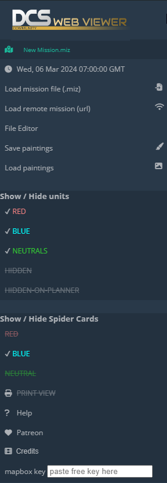

# Main Panel

Mouse over the DCS Web Viewer logo in the top-left to reveal the main panel:

## Load

Press `Load mission file (.miz)`, alternatively use the `Ctrl + L` keyboard shortcut. This will open a file explorer window to navigate to your desired .miz file.

`Load remote mission (url)` loads a .miz file hosted over a local or web server.

## File Editor

When a mission is loaded, options will appear to download the different script files contained within the .miz.

## Paintings

All paintings and text added via the drawing or text tool can be exported in a `.json` format via `Save paintings`, allowing for visual preperation of a briefing beforhand.

`Load paintings` will load a paintings `.json` file.

These paintings are compatible with the DCS Web Editor and vice versa.

## Show / Hide Units

These options allow the user to hide units related to a particular coalition, or it's 'Hidden' properties set within the editor.

## Show / Hide Spider Cards

These options will show a circular grid pattern originating from the respective coalition's Bullseye.

## Print View

Print View removes UI elements to allow for decluttered screenshots.

## Mapbox Key

To allow for certain Map Tiles to load, head to [https://account.mapbox.com/auth/signup/](https://account.mapbox.com/auth/signup/) and sign up for a mapbox key, which you can paste here.