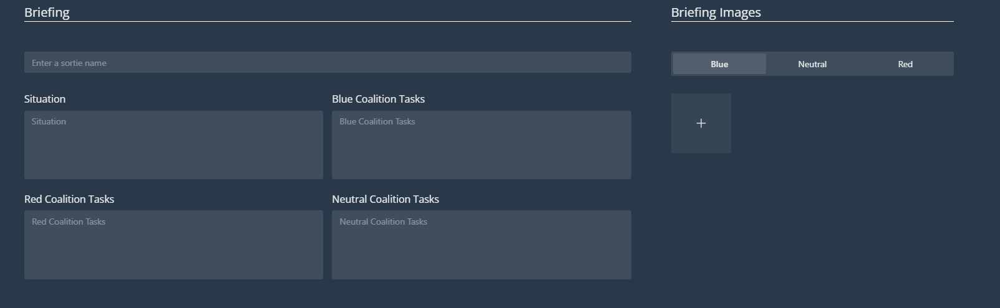

# Map Options

**Work in progress**

Click on Map Options to expand it:  
 

## Briefing
  
  
  
As in the native editor, customize the briefing panel displayed at the beginning of a mission.  
  
### Briefing Template
**Work in progress**

## Coalitions

  
  
As in the native editor, customize your coalitions. Select a nation from the list and use the top three-way switch to assign it to a category. You can also select a preset from the drop-down menu in the top-left.
  
## Weather
  
  
  
As in the native editor, manipulate weather settings.

## Date and Time

Choose your own date, or use the 'Now' button to choose your present time. Press 'Confirm' when you have made your selection.
 
 
