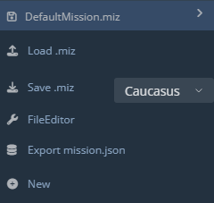
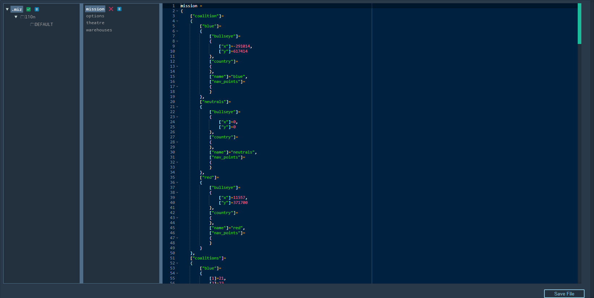

# Mission Manipulation

## Overview

  
  

The mission panel allows you to load and save missions, create a new instance of the DCS Web Editor, as well as use some cool tools for manipulating the script files of your missions.

## Create

Creating a new mission in DCS Web Editor is simple. Press the '+ New' button. This will open a new browser tab with a clean mission. Remember to change to the desired Theatre with the dropdown menu before placing units.

## Load

Press 'Load .miz', alternatively use the 'Ctrl + L' keyboard shortcut. This will open a file explorer window. Navigate to your desired .miz file and open it.

## Save

Press 'Save .miz' to bring up the file explorer. Alternatively use the 'Ctrl + S'(save mission) or 'Ctrl + Shift + S'(save mission without prompt) keyboard shortcuts. 

## File Editor

Next is the File Editor.

If you know your way around the scripting end of your mission files, this can be a handy tool to find or change scripts within the mission quickly. Select the folder on the far left panel and the script itself on the panel to the immediate right of that.

## Export mission.json

As the name suggests, this button will export the mission script file contained within the .miz in a .json format.

## Theatre

The theatre dropdown enables you to select the current theatre you wish to edit.

NOTE: If you scroll to a different region on the map and begin placing units, the editor will allow you to do so even if you haven't selected the correct theatre in the dropdown. In this case, the necessary changes to the scripts in the .miz will NOT be made. 

ALWAYS select the theatre you plan to work in with the dropdown menu to ensure your units aren't deleted when transferring to DCS.

