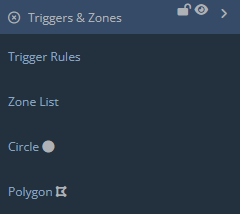
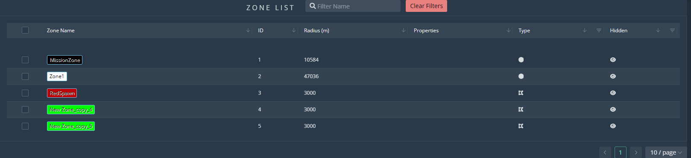
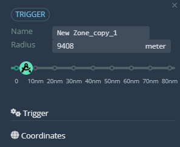
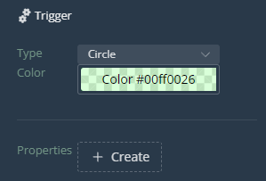

## Triggers & Zones

**Work in progress**

  
  
The first element of the Triggers panel is the Trigger Rules button:  
  
  
This window allows the user to upload trigger rules in .json format.  
  
Zone List:  
  
  
This window is similar in layout to the ones we covered before, so let's go over the main section: 
- Zone Name displays the zone, as well as it's color.
- ID is a unique identifier number.
- Radius displays the size of the zone, in meters.
- Properties displays the amount of property key-value pairs assigned to that zone.
- Type shows the type zone, circle or polygon.
- Hidden once again shows whether the unit is hidden or shown.  
  
Next are the Circle and Polygon buttons. These buttons are utilized to place the respective zones.

## Zone Panel

Displays the zone name and radius.

On the panel is also a slider to increase/decrease the size of the zone.

### Zone Settings

Select/change the zone type with the 'Type' dropdown menu. Directly below that, select the color of the zone.

At the bottom is a 'Properties' section with a 'Create' button. Clicking this will create a window to enter Key:Value pairs.

### Coordinates

Here you will find the coordinates for the center of the zone.

### Zone Manipulation
#### Place Zones

To place a zone, from the main editor panel on the left, click and drag from the 'Circle' button onto the map. Where you drop it is where the zone will be placed.

#### Select/Deselect Zones

Work in progress.

#### Move Zones

Work in progress.