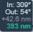
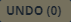

# UI Tools

**Work in progress. All content within is subject to change.**  
  
### Mouse Navigation

Left-click and drag to move around the map. 
  
Click on points of interest, such as airports, to open information windows.  
  
Right-click anywhere on the map to open a coordinate window where you can click on your preferred coordinate type to copy it to clipboard. Also contained within this window is a 'Paste here' button, which you can use to paste any units or other entities currently contained within your clipboard.

The 'GoogleMaps' and 'SkyVector' buttons will take you to the respective mapping and flight planning websites.

### Keyboard Shortcuts

- Shift + Left-Click + drag -> box-select units, triggers, waypoints, drawings etc
- Delete -> delete selected units, triggers, waypoints
- Escape -> deselect all
- Right-Click -> deselect all, open mouse location info / coordinates
- Paint mode + Left Click + MouseMove -> Draw lines. Left-Cick to delete lines
- Paint mode + Left Click + CTRL + MouseMove -> Draw dotted lines.
- Ctrl + S -> save mission
- Ctrl + Shift + S -> QuickSave mission ( no prompt )
- Ctrl + C -> copy selected units, triggers
- Ctrl + V -> paste selected units, triggers
- Ctrl + L -> load mission
- Ctrl + Z -> undo ( up to 20 steps )
- Shift + R -> Random rotation of selected units
- Shift + Alt + R -> Align selected units rotation to 0°
- Shift + L -> Align selected units to line ( uses paste x/y offset )
- Shift + P -> Randomize position of selected units ( uses paste x/y offset )
- Shift + G -> Align selected units to grid ( uses paste x/y offset )
- Shift + T -> Transform / scale / rotate selected units. Press ESCAPE to exit transform mode.
- If the fonts are too large/small, you can also use the browser zoom Ctrl +  and Ctrl -

## Map Tools

Map Tiles:  
  
  
  
This button opens a menu where you are able to choose your desired map tile type, as well as map options to customize your experience.  
  
Marker Color: 
  

  
Use this button to reveal the marker color palatte. Choose your color and then left-click anywhere on the map to close the window.
  
The bottom left of the map screen consists of six blocks of information.
There's the location block:

  
  
The map zoom and scale bars:

  
  
  

The Drawing tool:

When selected, this tool allows for drawing on the map with a marker using your mouse. Color is selected via the Marker Color tool as shown above. Click on any mark to erase it.

The Text tool:

Enable this tool and click anywhere on the map to insert text. Text color is chosen via the Marker Color tool.
  
And finally the Polyline Measurement tool:

  
  
To use this tool, click on the top arrow button to highlight and activate it. Click anywhere on the map to begin your measurement sequence. You may create as many sequence legs as you desire.  
You will notice an information box accompanying each point:

  
  
The top number represents the incoming leg azimuth, while the second number represents the outgoing leg azimuth.
The grey number is the current leg length, and the green number is the total length of the sequence.  
  
To erase all measurement sequences, press the 'x' on the Polyline Measurement tool.  
  
To change the measurement units, click the bottom and final button of the tool. This will cycle between nm (nautical miles), km (kilometers), and mi (miles).  
  

## Panel Tools

These tools are found at the bottom of the Editor Main Panel.

### Offset

The Offset Panel:  
  
  
This panel contains two fields to input numbers according to your desired paste offset ranges. Insert negative values for left/down.

Undo:

This button has the same function as the keyboard shortcut. Sequentially undo previous edits.

The tool will also display the action to be undone, as well as how many edits are in memory.
