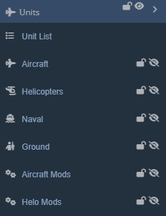
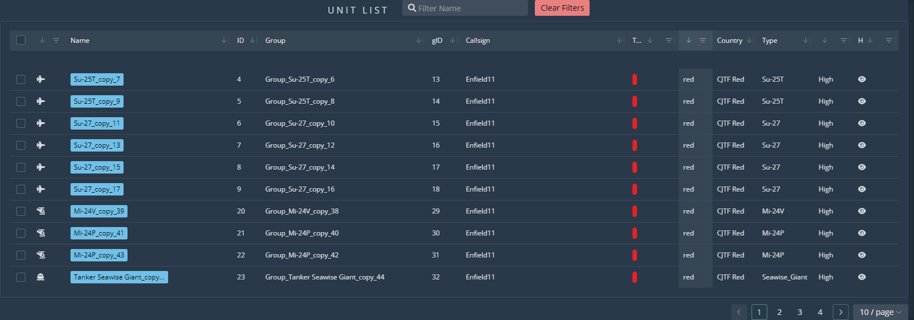
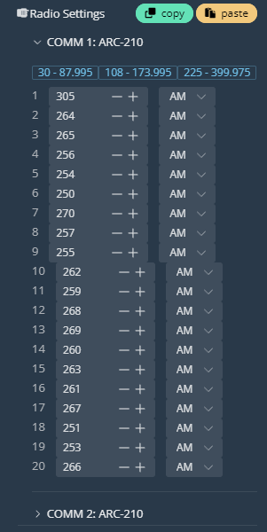

# Units

**Work in progress**

  
  
## Overview

Select the 'Unit List' to display the following:

  
  
At the top of the window you can filter via a search criteria. At the bottom right of the window are selectors for additional pages of units, as well as a display limit dropdown menu.  
  
Breaking down the main section:  
- Name displays the name of the unit.  
- ID is a unique number identifier of the unit.
- Group is the name of the group the unit is assigned to, and gID is the group number identifier.  
- Callsign shows the identifier the unit will be using over radios in-game.  
- Task has a dropdown menu where you can select filters to display units by the task assigned to them.  
- Coalition filters and displays by red/blue coalition.  
- Country displays the country of the unit.  
- Type shows the vehicle type of the unit.  
- Skill shows the skill level assigned to the unit.  
- Hidden displays whether the unit is hidden/shown. You can also filter by these criteria.  
  
Select individual units via the selector boxes on the left-hand side. This will also select the units on the map.

Following the Unit List are the Unit Selector Buttons. All of these buttons send you to the same place: the Units window:

  
  
This window contains all of the placeable units of the editor. The very top contains a search field to search for specific units, as well as a coalition and country dropdown menu. In the top left are the unit type selector tabs. These mirror the unit selector buttons in the Unit category of the Editor Interface. Each named tab contains the units of the corresponding type.

## Unit Panel

Not the unit type and faction at the top. Just below is the name and group of the unit, which can both be changed.

Add unit will add a unit to this unit's group.

The heading tape sets the starting face direction of the unit.

Each of the settings can be clicked to expand, as well as copied and pasted between groups.

### Group Settings

Cnd/Spwn sets unit condition (health) and spawn chance of the unit between 0 and 1. To set a 50/50 spawn chance, set 0.5.

Task is selected via the dropdown menu. To the right of task is the hourglass Mission Start/Late Activation switch.

Frequency and Modulate set the initial frequency settings for radio 1.

To the right of frequency, set whether the unit's radios are enabled.

Auto-rename sets the name for all units in the group according to the Group name variable, or just for selected units, depending which option you choose. If, for example, you enter 'Whiskey' as your group name for a group of four and press the 'Auto-rename units in group' button, the units will be renamed to 'Whiskey_1' through 'Whiskey_4.'

### Unit Settings

Set the Skill, Tail Number, Livery, and Callsign of the unit.

### Radio Settings

Change the radio channel frequencies for each radio. Note the frequency ranges at the top of the dropdown for easy reference.

### Loadout

Select a Preset loadout from the dropdown menu.

Set desired Chaff, Flare, Fuel, and Gun ammo quantities.

If you wish to customize your loadout, press the 'edit' button to bring up the Payload Editor interface:

From this menu, select a preset in the top-left dropdown if desired. Hover over each station to reveal payload options and select your desired armament. Note the weight of each weapon along the bottom. Click anywhere on the map to close the Payload Editor.

### Waypoints

This menu sets parameters for Waypoint 0 (start position) of the aircraft.

### Visibility

'Hidden' hides the unit from the editor map, if hidden units are set to invisible.

'Hidden on Planner' hides the unit from the briefing window at the start of a mission.

'Hidden on MFD' hides the unit from any aircraft's situational display, such as the F/A-18s SA page or the AH-64s TSD, etc.

### Coordinates

Displays and allows for easy copying of the unit's coordinates.

## Unit Manipulation
### Place Units

From any of the Units tabs in the Units window, click and drag a unit from the window onto the map to place.

Copy and Paste any unit or group of units by selecting them via Shift + LClick + Drag, and then Ctrl + C to copy, Ctrl + V to paste. You can also paste units by right-clicking on the map and selecting 'Paste Here' from the coordinate window.

### Select/Deselect Units

Click on any unit to open it's Unit Panel.

Select units by Shift + LClick + Dragging the Select Box over the unit(s).

Deselect units with Esc.

### Move Units

Click and drag units to move them. Units do not need to be selected to move them with this method.

Select multiple units with the Select Box and move them using the same method.

### Transform Units

Shift + R will rotate selected units in random directions.

Shift + Alt + R rotates selected units to 0 degrees.

Shift + L aligns selected units along a single axis, using Paste Offset parameters for spacing and direction.

Shift + P randomizes the position of selected units using Paste Offset parameters.

Shift + G aligns selected units to a grids, using Paste Offset parameters to build the grid spacing.

Shift + T to transform, scale, and rotate selected units. Select units and then press Shift + T to show the Transformation Box. Clicking and dragging within the box will drag the units. Clicking and dragging edge tabs will scale the units along that axis. Clicking and dragging just outside a corner tab will allow for rotation of selected units. Press Esc or RClick anywhere to deselect the units and Transformation Box.

### Delete Units

Press Del to delete any selected units.

To delete units through the Unit List, open the Unit List and select all units you wish to delete. Then close the Unit List by clicking on the interface Unit List button. Then press Del. Note that pressing Esc in the Unit List panel will NOT close the panel, but deselect all selected units instead.

